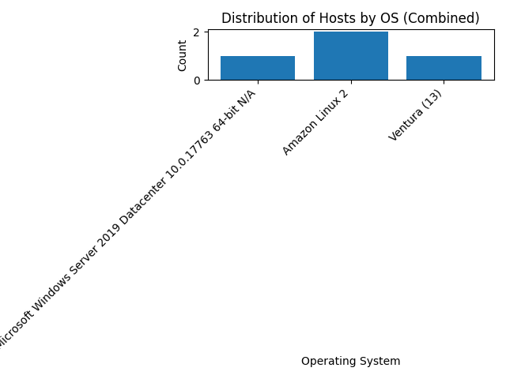
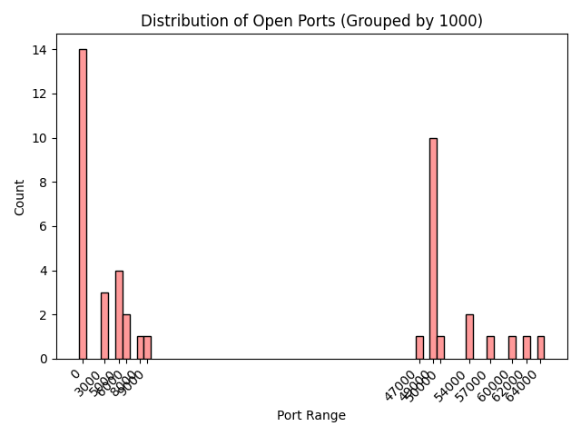

# Silk Data Pipeline

## Overview
This project implements a data pipeline to:
- Fetch raw host data from Qualys and CrowdStrike APIs.
- Normalize the data into a unified format.
- Deduplicate records.
- Save the processed data into MongoDB.
- Generate visualizations for insights.

## Features
1. **Data Normalization**: Standardizes host data from Qualys and CrowdStrike.
2. **Data Deduplication**: Identifies and merges duplicate records.
3. **MongoDB Integration**: Stores processed data for analysis.
4. **Visualization**:
   - Distribution of hosts by OS.
   - Old vs. new hosts.
   - Distribution of open ports.

## Requirements
- Python 3.10
- MongoDB
- `python-dotenv` for managing environment variables.
- `matplotlib` for visualizations.

## Installation
1. Clone the repository:
   ```bash
   git clone https://github.com/jabeenshres/silk_data_pipeline.git
   cd silk_data_pipeline


---

## Visualizations
The generated visualizations are saved in the `images/` directory. Below are some insights derived from the data:

### **1. Distribution of Hosts by OS (Combined)**
This visualization shows the distribution of operating systems across all hosts.


### **2. Old vs. New Hosts (Combined)**
This visualization compares all hosts scanned within the last 30 days versus those scanned earlier.


### **3. Distribution of Open Ports (Combined)**
This visualization shows the distribution of open ports detected across all hosts.
